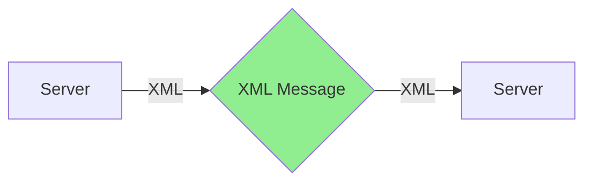
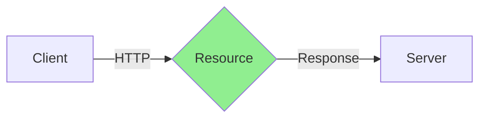
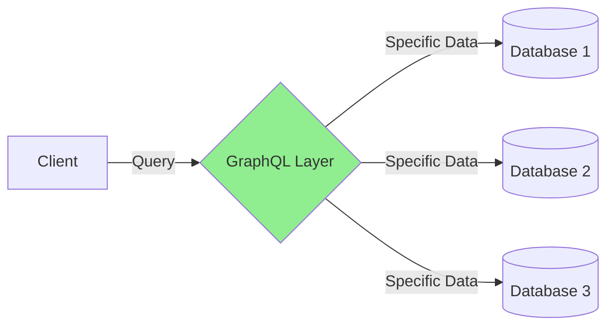
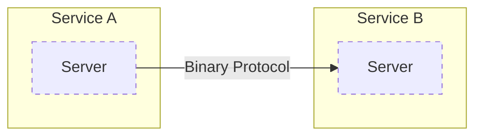
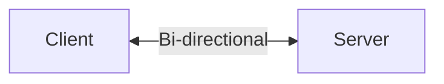
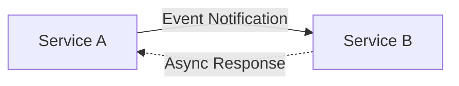

# API Architecture Styles: A Comprehensive Guide

## Introduction
Modern software architecture relies heavily on different API styles, each designed to solve specific problems and optimize particular use cases. This guide explores the six main API architecture styles, their characteristics, and ideal implementation scenarios.

## Understanding API Architectures

### 1. SOAP (Simple Object Access Protocol)

SOAP represents one of the most mature API architectures in enterprise computing. It uses XML for message formatting and operates primarily over HTTP, though it can work with other protocols. 

Key characteristics:
- Built-in error handling
- Language, platform, and transport independent
- Works well with distributed enterprise environments
- Strong typing and strict contracts through WSDL

Ideal for enterprise applications where formal contracts between services are required, especially in industries like finance and healthcare where standardization is crucial.

### 2. RESTful Architecture

REST (Representational State Transfer) has become the de facto standard for web APIs. It treats everything as a resource that can be accessed using standard HTTP methods.

Key characteristics:
- Stateless communication
- Uniform interface using HTTP methods (GET, POST, PUT, DELETE)
- Resource-based URLs
- Support for multiple data formats (JSON, XML, etc.)

Perfect for web applications where HTTP-based integration is needed, particularly when building public APIs that need to be easily consumed by various clients.

### 3. GraphQL

GraphQL revolutionizes API design by allowing clients to request exactly the data they need, nothing more and nothing less.

Key characteristics:
- Single endpoint for all data needs
- Client-specified queries
- Strong typing system
- Real-time updates with subscriptions
- Reduced network overhead

Excellent for applications requiring flexible data querying, especially mobile applications where bandwidth efficiency is crucial.

### 4. gRPC

gRPC, developed by Google, uses HTTP/2 and Protocol Buffers to provide high-performance, language-agnostic remote procedure calls.

Key characteristics:
- Binary protocol for efficient data transfer
- Built-in streaming support
- Strong typing through protocol buffers
- Code generation for multiple languages
- Bidirectional streaming

Ideal for microservices architectures where low-latency and high-performance communication between services is crucial.

### 5. WebSocket

WebSocket provides full-duplex communication channels over a single TCP connection, enabling real-time data exchange.

Key characteristics:
- Persistent connection
- Bi-directional communication
- Low latency
- Protocol independence
- Real-time data capabilities

Perfect for applications requiring real-time updates like chat applications, gaming, or live dashboards.

### 6. Webhook

Webhooks implement a publish-subscribe pattern, allowing services to automatically notify others about events or changes.

Key characteristics:
- Event-driven architecture
- Asynchronous communication
- HTTP-based delivery
- Custom payload formats
- Retry mechanisms

Ideal for event-driven applications where automatic notifications about state changes are required, such as payment processing or content management systems.

## Choosing the Right Architecture

When selecting an API architecture, consider these factors:

1. Use Case Requirements
   - Real-time needs
   - Data complexity
   - Performance requirements
   - Scale considerations

2. Client Capabilities
   - Target platforms
   - Network conditions
   - Developer expertise
   - Integration requirements

3. Organizational Constraints
   - Legacy system compatibility
   - Security requirements
   - Development resources
   - Maintenance capabilities

## Best Practices for Implementation

### Documentation
Regardless of the chosen architecture, comprehensive documentation is crucial. Include:
- API reference
- Authentication methods
- Request/response examples
- Error handling
- Rate limiting policies

### Security
Implement appropriate security measures:
- Authentication
- Authorization
- Data encryption
- Input validation
- Rate limiting

### Monitoring
Set up robust monitoring:
- Performance metrics
- Error rates
- Usage patterns
- Response times
- Resource utilization

## Conclusion

Each API architecture style offers unique advantages for specific use cases. Understanding these differences helps in making informed decisions about which style best suits your requirements. Remember that hybrid approaches are sometimes necessary, and it's acceptable to use different styles for different parts of your system based on specific needs.
