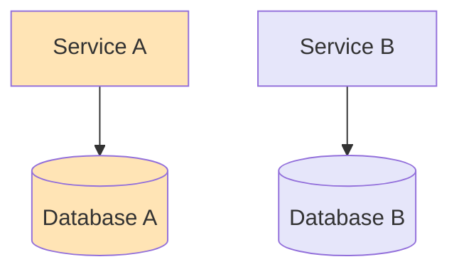
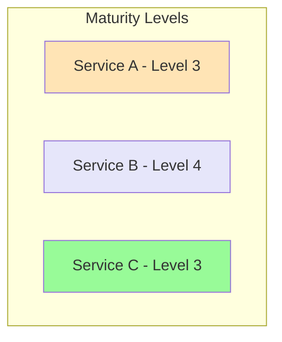
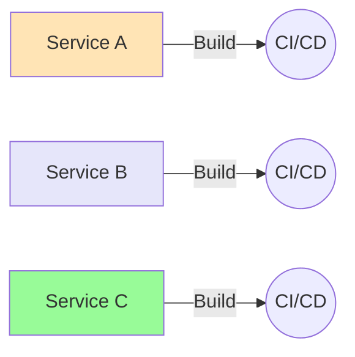
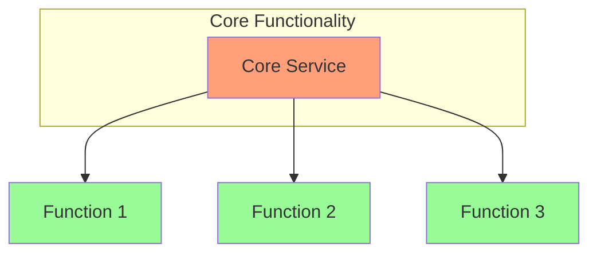
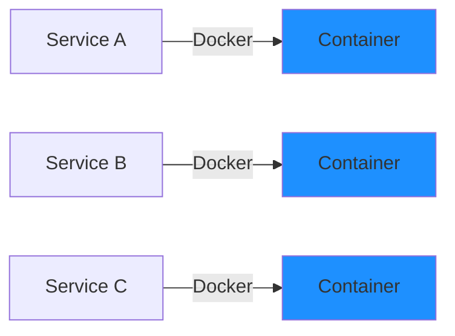
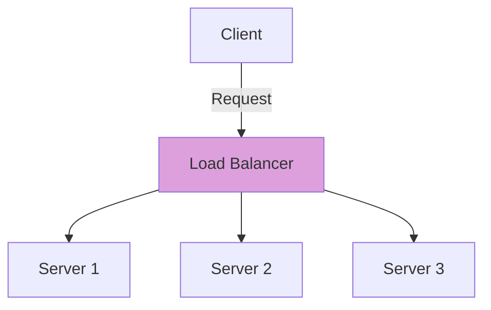
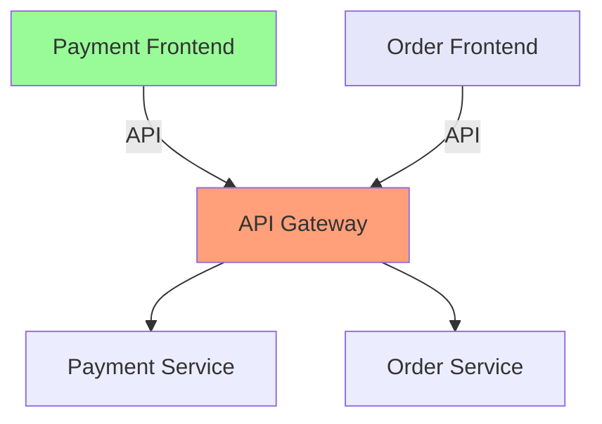
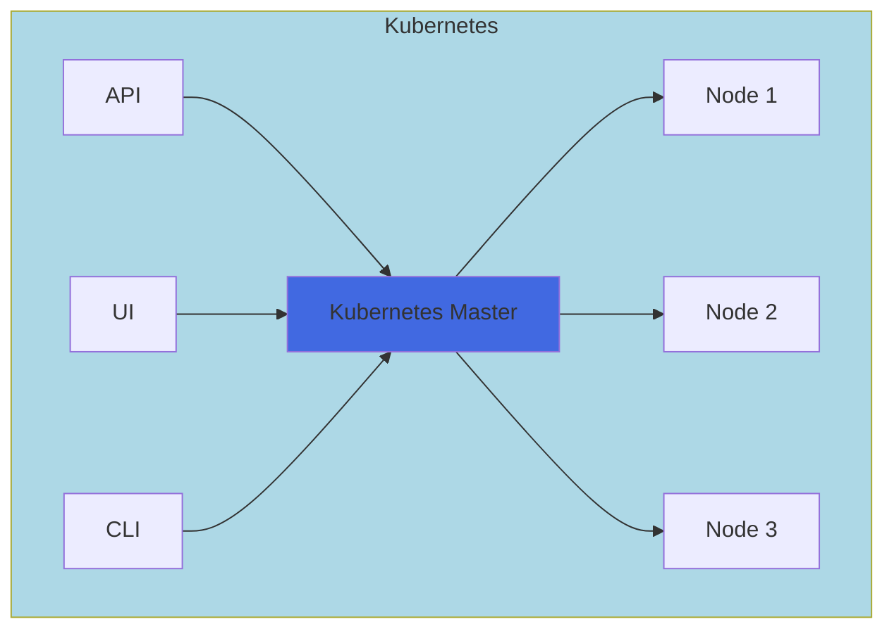

# Microservice Best Practices: A Comprehensive Guide

## Introduction

Microservices architecture has revolutionized how we build and deploy applications, but implementing it effectively requires following established best practices. This guide explores nine essential practices that help create robust, maintainable, and scalable microservice architectures.

## 1. Separate Data Store

Every microservice should maintain its own dedicated database, ensuring true service independence and data autonomy.



### Why This Matters
When each service manages its own data, we achieve several benefits:
- Data isolation prevents unexpected coupling between services
- Services can choose the most appropriate database technology for their specific needs
- Changes to one service's data structure don't impact other services
- Each service can scale its database independently

### Implementation Guidelines
- Choose appropriate database types for each service's needs (SQL, NoSQL, Graph, etc.)
- Implement clear data ownership boundaries
- Use event sourcing or saga patterns for distributed transactions
- Maintain data consistency through eventual consistency patterns

## 2. Keep Code at a Similar Level of Maturity

Maintaining consistent code maturity across services helps prevent technical debt and ensures system reliability.



### Implementation Strategies
- Define clear maturity metrics for all services
- Establish coding standards and best practices
- Regular code reviews and refactoring sessions
- Automated testing requirements for each maturity level
- Documentation standards for each level

## 3. Separate Build for Each Microservice

Independent build processes ensure true service autonomy and enable faster deployment cycles.



### Key Benefits
- Independent deployment capabilities
- Faster build times
- Reduced risk of cross-service dependencies
- Easier rollback procedures
- Team autonomy in deployment decisions

## 4. Single Responsibility

Each microservice should focus on doing one thing well, following the Single Responsibility Principle.



### Guidelines for Service Boundaries
- Clear business capability alignment
- Well-defined service interfaces
- Minimal cross-service dependencies
- Focused domain expertise

## 5. Deploy into Containers

Containerization provides consistency across environments and simplifies deployment.



### Container Best Practices
- Use lightweight base images
- Implement proper security scanning
- Define clear resource limits
- Maintain proper logging configurations
- Implement health checks

## 6. Treat Servers as Stateless

Stateless services improve scalability and reliability by eliminating server-specific state.



### Implementation Considerations
- Store session data externally
- Use distributed caching
- Implement proper load balancing
- Design for horizontal scaling
- Handle failure gracefully

## 7. Domain-Driven Design

Domain-Driven Design (DDD) helps create maintainable and business-aligned microservices.

```mermaid
graph TB
    subgraph Domain Core
    E[Entities]
    A[Aggregates]
    VO[Value Objects]
    end
    
    subgraph Application Layer
    S[Services]
    R[Repositories]
    end
    
    subgraph Infrastructure
    I[Infrastructure Services]
    end
    
    Domain Core --> Application Layer
    Application Layer --> Infrastructure
    
    style Domain Core fill:#FF6347
    style Application Layer fill:#98FB98
    style Infrastructure fill:#87CEEB
```

### Key DDD Concepts
- Bounded contexts
- Ubiquitous language
- Aggregates and entities
- Domain events
- Strategic design patterns

## 8. Micro Frontend

Extending microservice principles to the frontend improves maintainability and team autonomy.



### Implementation Strategies
- Component-based architecture
- Independent deployment capability
- Shared styling guidelines
- Cross-team collaboration practices
- State management patterns

## 9. Orchestrating Microservices

Proper orchestration ensures smooth operation of the entire microservice ecosystem.



### Orchestration Considerations
- Service discovery
- Load balancing
- Health monitoring
- Scaling policies
- Failure recovery

## Best Practices for Implementation

### Monitoring and Observability
- Implement comprehensive logging
- Use distributed tracing
- Monitor service health
- Track performance metrics
- Set up alerting systems

### Security Considerations
- Implement service-to-service authentication
- Use API gateways for external access
- Regular security audits
- Proper secret management
- Network security policies

### Testing Strategies
- Unit testing
- Integration testing
- Contract testing
- Performance testing
- Chaos engineering

## Conclusion

Successfully implementing microservices requires careful attention to these best practices. Remember that these practices should be adapted to your specific context and requirements. Regular review and refinement of these practices ensures your microservice architecture remains robust and maintainable over time.