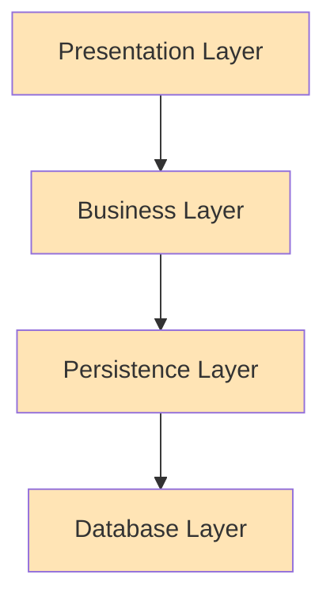
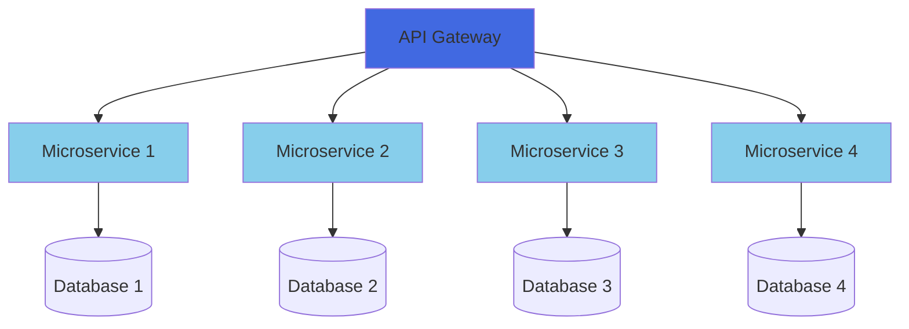
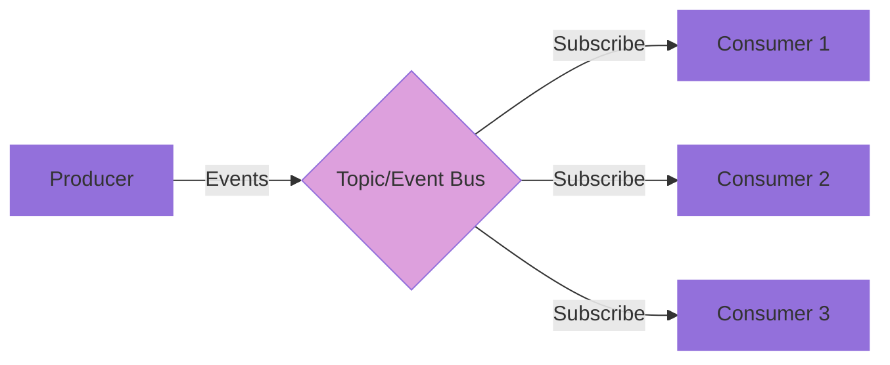
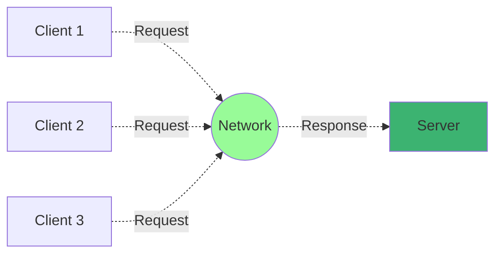
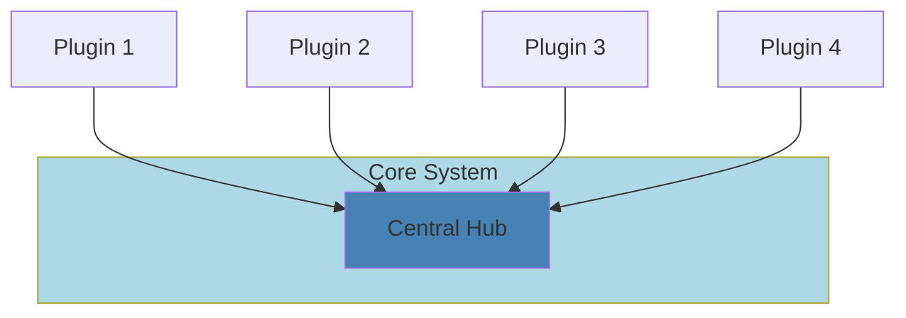
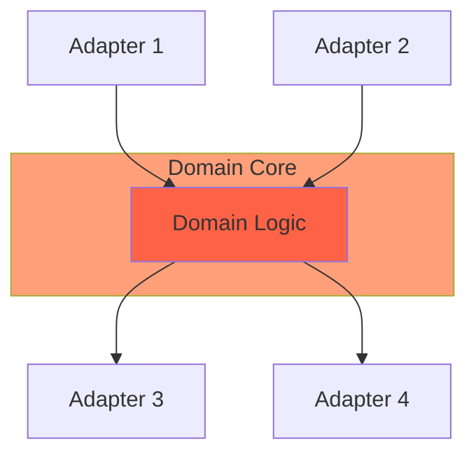

# Essential Software Architectural Patterns: A Comprehensive Guide

## Introduction

Software architectural patterns are reusable solutions to common problems in software architecture. Understanding these patterns is crucial for designing scalable, maintainable, and efficient systems. This guide explores six fundamental patterns that every software architect should know.

## 1. Layered Architecture

The layered architecture pattern, also known as n-tier architecture, organizes code into layers of distinct functionality, where each layer serves a specific purpose in the application.

### Key Components
- **Presentation Layer**: Handles user interface and user interactions
- **Business Layer**: Contains business logic and processing rules
- **Persistence Layer**: Manages data persistence operations
- **Database Layer**: Handles data storage and retrieval

### Benefits
- Clear separation of concerns
- Easy to maintain and modify individual layers
- Supports the principle of abstraction
- Allows for independent testing of components

### When to Use
- Enterprise applications with complex business rules
- Systems requiring clear separation of concerns
- Applications needing multiple data sources
- Projects with large development teams working on different layers

## 2. Microservice Architecture

Microservice architecture structures an application as a collection of loosely coupled, independently deployable services.

### Key Characteristics
- Independent deployment and scaling
- Service-specific databases
- Loosely coupled components
- API Gateway for request routing
- Event-driven communication between services

### Benefits
- Improved scalability and fault isolation
- Technology diversity
- Faster deployment cycles
- Better team autonomy

## 3. Event-Driven Architecture

Event-driven architecture focuses on the production, detection, and reaction to events that occur in a system.

### Components
- Event producers
- Event channel/bus
- Event consumers
- Event processing logic

### Advantages
- Loose coupling between components
- Excellent scalability
- Real-time processing capabilities
- Easy to add new consumers

## 4. Client-Server Architecture

This fundamental pattern separates concerns between clients that request services and servers that provide services.

### Characteristics
- Clear separation between client and server
- Centralized data storage
- Multiple client support
- Network-based communication

### Use Cases
- Web applications
- Email systems
- File sharing services
- Database applications

## 5. Plugin-Based Architecture

This pattern creates a core system that can be extended through plugins or modules.

### Key Features
- Extensible core system
- Standardized plugin interface
- Dynamic loading/unloading
- Version management

### Benefits
- Easy system extension
- Modular development
- Reduced core complexity
- Flexible configuration

## 6. Hexagonal Architecture

Also known as Ports and Adapters, this pattern aims to create loosely coupled application components.

### Components
- Core domain logic
- Ports (interfaces)
- Adapters (implementations)
- External systems

### Advantages
- Business logic isolation
- Easy testing
- Framework independence
- Flexible external connections

## Choosing the Right Pattern

When selecting an architectural pattern, consider:

1. System Requirements
   - Scale needs
   - Performance requirements
   - Maintenance considerations
   - Team structure and size

2. Business Context
   - Time to market
   - Budget constraints
   - Team expertise
   - Future growth plans

3. Technical Constraints
   - Existing systems
   - Integration requirements
   - Development tools
   - Deployment environment

## Best Practices for Implementation

### Documentation
Maintain comprehensive documentation covering:
- Architecture decisions
- Component interactions
- Integration points
- Deployment procedures

### Testing Strategy
Implement testing at multiple levels:
- Unit testing
- Integration testing
- System testing
- Performance testing

### Monitoring and Maintenance
Establish robust monitoring:
- Performance metrics
- Error tracking
- Usage patterns
- Resource utilization

## Conclusion

Each architectural pattern serves specific needs and comes with its own trade-offs. Understanding these patterns helps in making informed decisions about system design. Remember that hybrid approaches are often necessary, and it's acceptable to combine patterns to meet specific requirements.