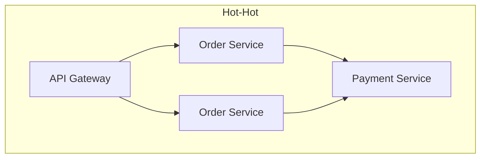
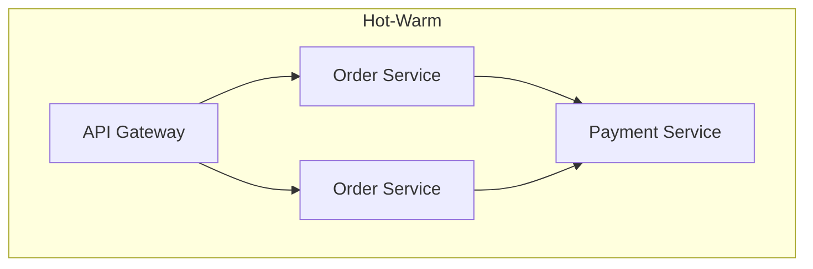
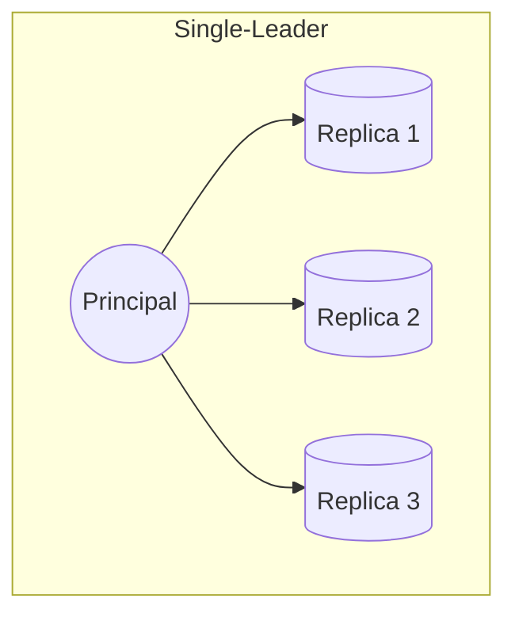
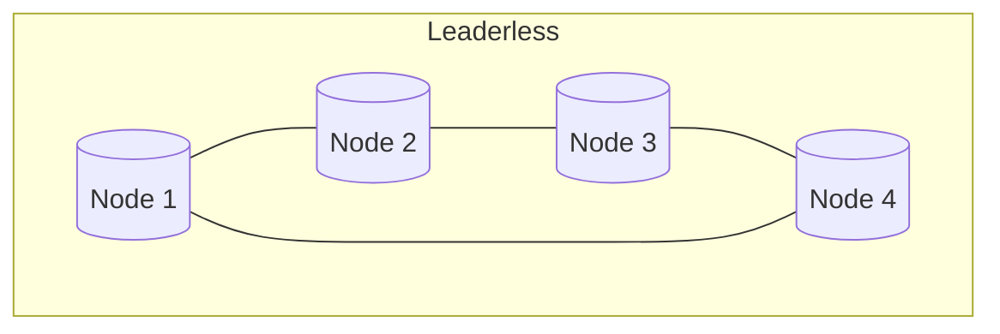
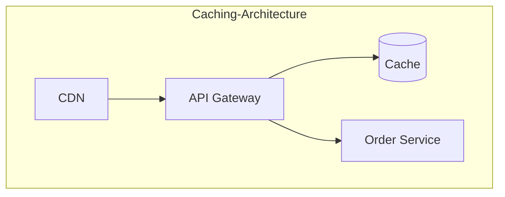
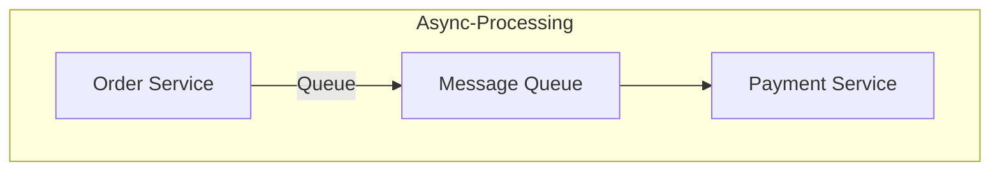
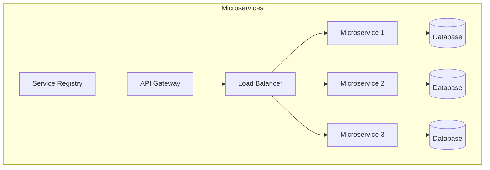

# System Design Principles: A Comprehensive Guide

## Introduction
System design requires careful consideration of several key attributes: high availability, high throughput, and high scalability. This guide explores these fundamental concepts and their practical implementations.

## 1. High Availability (24/7)
High availability ensures a system maintains an agreed level of uptime through redundancy and eliminating single points of failure.

### Key Measurements
- **Four Nines (99.99%)**: Translates to 8.64 seconds of downtime per day
- **Five Nines (99.999%)**: Translates to 864 milliseconds of downtime per day
- **RTO (Recovery Time Objective)**: The target time within which a system must be restored after a disruption
- **RPO (Recovery Point Objective)**: The maximum acceptable amount of data loss after a recovery

### Common Architectural Patterns

## 2. High Throughput
High throughput focuses on processing more requests in a given period of time.

### Key Metrics
- **QPS (Queries Per Second)**: Number of queries the system can handle per second
- **TPS (Transactions Per Second)**: Number of transactions processed per second

### Optimization Principles
- Implement effective caching strategies
- Identify and resolve system bottlenecks
- Scale through multiple threads and instances
- Implement spike management techniques

### Common Solutions

## 3. High Scalability
High scalability enables quick extension to handle more volume or functionalities with minimal changes.

### Key Considerations
- **RT (Response Time)**: Time taken to process and respond to a request
- Service segregation
- Load balancing and service discovery
- Capacity planning

### Microservices Architecture

## Best Practices and Implementation Guidelines

### High Availability
- Implement redundancy at all levels
- Avoid single points of failure
- Regular backup and disaster recovery testing
- Use health checks and automatic failover

### High Throughput
- Implement caching at multiple levels (CDN, Application, Database)
- Use connection pooling
- Optimize database queries
- Implement asynchronous processing where possible

### High Scalability
- Design with microservices architecture
- Implement effective load balancing
- Use service discovery mechanisms
- Plan capacity based on metrics and growth projections

## Conclusion
Building highly available, high-throughput, and highly scalable systems requires careful consideration of various architectural patterns and principles. The key is to choose the right combination of patterns based on specific use cases and requirements while maintaining a balance between complexity and maintainability.
