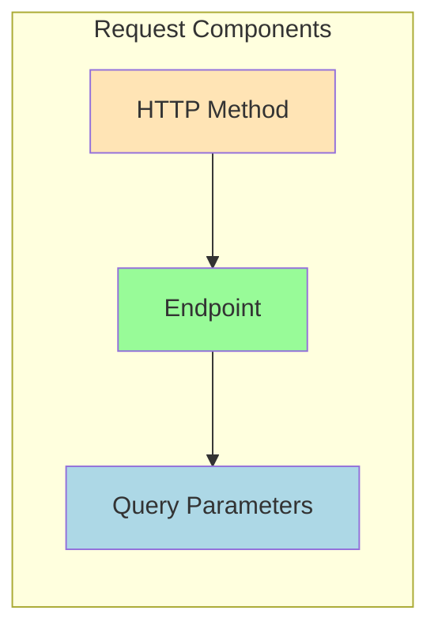
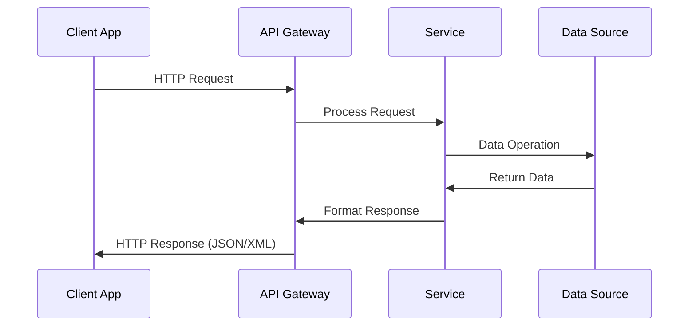
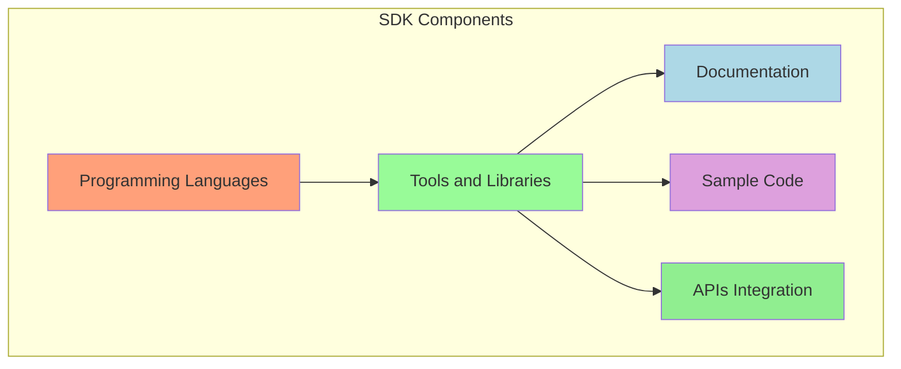
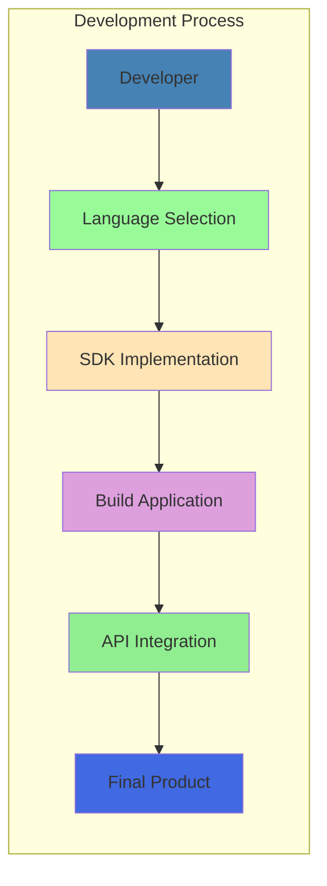
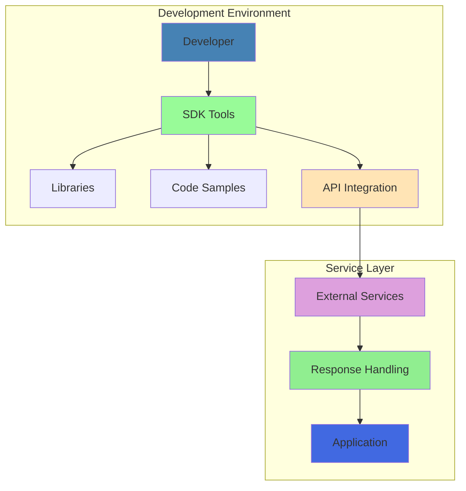
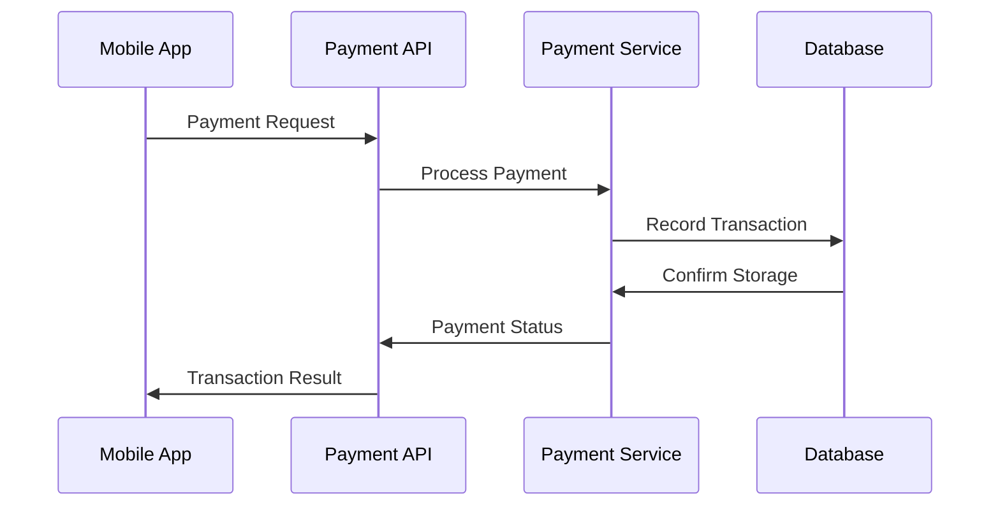
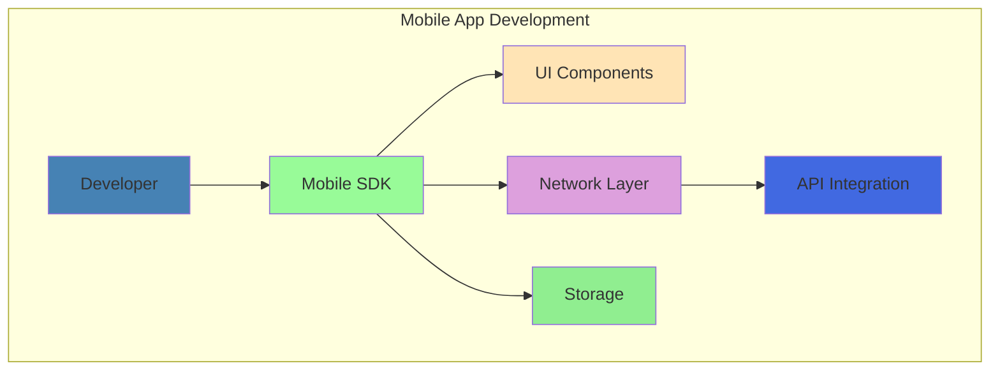

# Understanding APIs and SDKs: A Comprehensive Guide

## Introduction

In modern software development, APIs (Application Programming Interfaces) and SDKs (Software Development Kits) serve as fundamental building blocks for creating applications and enabling communication between different software systems. While they might seem similar at first glance, they serve distinct purposes and complement each other in the development ecosystem.

## APIs: The Communication Protocol

An API acts as a communication protocol between different software applications. Think of it as a waiter in a restaurant who takes your order (request) to the kitchen and brings back your food (response). The waiter doesn't cook the food but provides a standardized way to interact with the kitchen's services.

### API Request Structure

The API request structure consists of three main components:

1. HTTP Method: Defines the type of operation to perform
   - GET: Retrieve data
   - POST: Create new data
   - PUT: Update existing data
   - DELETE: Remove data

2. Endpoint: The specific URL where the API is hosted
   - Usually follows a logical structure
   - Represents the resource being accessed
   - Examples: `/users`, `/products`, `/orders`

3. Query Parameters: Additional information for the request
   - Filters
   - Authentication keys
   - Specific options or configurations

### API Communication Flow

## SDKs: The Developer's Toolbox

An SDK is a collection of tools, libraries, documentation, code samples, and processes that developers can use to create software applications for specific platforms or programming languages. Think of it as a complete workshop with all the tools and instructions needed to build something specific.

### SDK Components and Structure

### SDK Development Flow

## Key Differences and Relationships

### APIs vs SDKs: Understanding the Distinction

1. Purpose and Function
   - APIs: Provide a specific way to communicate between software systems
   - SDKs: Provide a complete development environment to build applications

2. Scope and Complexity
   - APIs: Focused on communication protocols and data exchange
   - SDKs: Comprehensive toolkit including multiple tools, libraries, and often multiple APIs

3. Usage Pattern
   - APIs: Used directly for specific service interactions
   - SDKs: Used throughout the development process to build complete applications

### Working Together

APIs and SDKs often work together in modern software development:

## Best Practices

### API Implementation

1. Security Considerations
   - Always use HTTPS
   - Implement proper authentication
   - Use API keys or tokens
   - Rate limiting to prevent abuse

2. Response Handling
   - Consistent error messages
   - Clear status codes
   - Proper data formatting
   - Comprehensive documentation

### SDK Usage

1. Development Guidelines
   - Follow platform-specific conventions
   - Maintain version compatibility
   - Handle dependencies properly
   - Include comprehensive documentation

2. Integration Best Practices
   - Keep SDKs updated
   - Follow security guidelines
   - Implement proper error handling
   - Use provided sample code as reference

## Common Use Cases and Examples

### Real-World API Implementation

### SDK Implementation Example

## Conclusion

Understanding the distinction between APIs and SDKs is crucial for modern software development. While APIs provide the communication protocols necessary for software systems to interact, SDKs offer the comprehensive tools needed to build applications effectively. Together, they form a powerful combination that enables developers to create sophisticated, integrated software solutions.

The key to successful implementation lies in understanding when and how to use each tool effectively:

- Use APIs when you need specific service interactions and data exchange
- Use SDKs when you need a complete development environment
- Combine both when building comprehensive applications that need to interact with external services

Remember that both APIs and SDKs continue to evolve with technology, making it essential to stay updated with the latest best practices and security considerations in your development process.