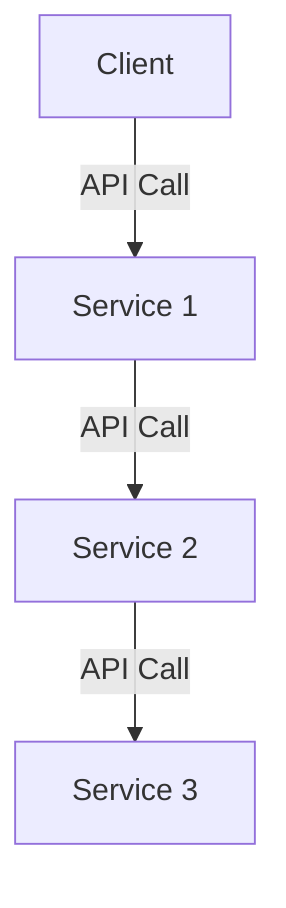
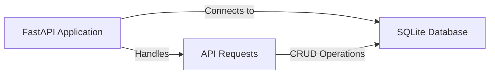
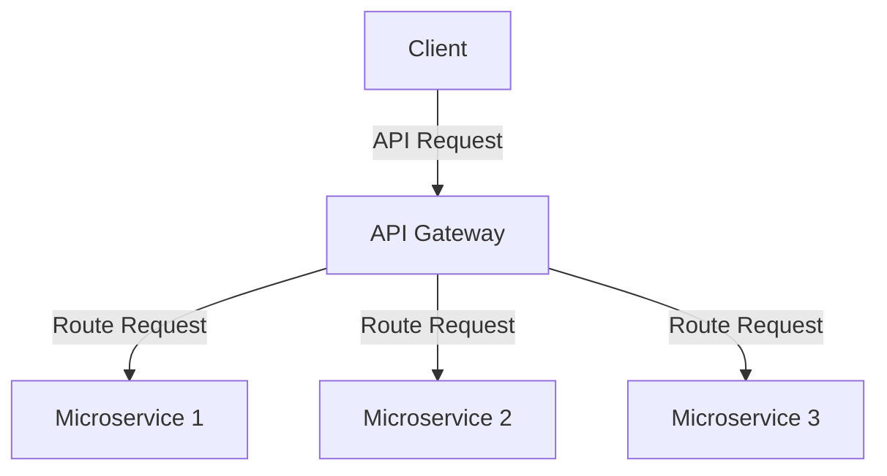

# Educational Session on APIs, Microservices, and FastAPI with SQLite

## Introduction to APIs and Microservices

APIs (Application Programming Interfaces) are the backbone of modern software development. They allow different software systems to communicate with each other. Microservices architecture, on the other hand, is a design approach where applications are built as a collection of small, independent services.

### Benefits of Microservices
- Scalability
- Independent Deployment
- Fault Isolation

### How APIs Facilitate Microservices


## Understanding API Design for Microservices

When designing APIs for microservices, it's crucial to adhere to RESTful principles and use HTTP verbs correctly[1]. Each verb should map directly to the intended action:

- GET: Fetch data
- POST: Create new resources
- PUT: Update existing resources
- DELETE: Remove resources

This approach ensures that your API is intuitive and aligned with common standards.

## FastAPI and SQLite Integration

FastAPI is a modern, high-performance web framework for building APIs with Python. SQLite is a lightweight, file-based database perfect for small projects or development environments.

### Steps to Integrate FastAPI with SQLite

1. Install dependencies:
```bash
pip install fastapi uvicorn sqlalchemy
```

2. Define database models using SQLAlchemy
3. Create a FastAPI application and connect it to the SQLite database
4. Define API endpoints for CRUD operations

### Example Code
See the following file for example code: `./micro-service-api.py`

### Visualizing the Architecture



## API Gateway in Microservices Architecture

An API gateway acts as a centralized entry point for all clients into the system. It's a reverse proxy that accepts client API calls and forwards them to the appropriate microservice[3].



## Best Practices for Learning and Implementation

1. **Start Small**: Begin with a simple project that uses REST principles[4].

2. **Iterative Development**: Keep modifying and adding features to your project to gain practical experience[4].

3. **Use Design Tools**: Leverage tools like Swagger/OpenAPI Editor to design your API in YAML/JSON and generate server-side stubs and client libraries[4].

4. **Follow Guidelines**: Refer to established guidelines like Microsoft's REST API Guidelines or Zalando's RESTful API guidelines for best practices[4].

5. **Hands-on Learning**: Build something you need or want to use that implements REST. This practical approach will teach you more than just theoretical knowledge[4].

## FastAPI SQLite Microservice Example

This is a simple microservice example built with FastAPI and SQLite, demonstrating RESTful API design principles and best practices.

### Prerequisites

- Python 3.8 or higher
- uv (modern Python package installer)

### Setup and Installation

1. Install uv if you haven't already:
```bash
pip install uv
```

2. Create and activate a new virtual environment:
```bash
# Create a new virtual environment
uv venv

# Activate the virtual environment
# On macOS/Linux:
source .venv/bin/activate
# On Windows:
.venv\Scripts\activate
```

3. Install dependencies using uv:
```bash
uv pip install -r requirements.txt
```

### Running the Application

1. Start the FastAPI server:
```bash
uvicorn micro-service-api:app --reload
```

The API will be available at http://127.0.0.1:8000

### API Documentation

Once the server is running, you can access:
- Interactive API docs (Swagger UI): http://127.0.0.1:8000/docs
- Alternative API docs (ReDoc): http://127.0.0.1:8000/redoc

### Available Endpoints

- `GET /health` - Health check endpoint
- `POST /items/` - Create a new item
- `GET /items/` - List all items (with pagination)
- `GET /items/{item_id}` - Get a specific item
- `PUT /items/{item_id}` - Update an item
- `DELETE /items/{item_id}` - Delete an item

### Example Usage

#### Create an Item
```bash
curl -X POST "http://127.0.0.1:8000/items/" \
     -H "Content-Type: application/json" \
     -d '{"name": "Test Item", "description": "This is a test item"}'
```

#### List Items
```bash
curl "http://127.0.0.1:8000/items/?skip=0&limit=10"
```

#### Get Specific Item
```bash
curl "http://127.0.0.1:8000/items/1"
```

## Database

The application uses SQLite as its database. The database file (`items.db`) will be automatically created in the same directory as the application when you first run it.

### Database Schema

The Items table has the following structure:
- `id`: Integer (Primary Key)
- `name`: String
- `description`: String
- `created_at`: DateTime
- `updated_at`: DateTime

## Development

### Code Structure
- `micro-service-api.py` - Main application file containing the FastAPI app and database models
- `requirements.txt` - Project dependencies
- `items.db` - SQLite database file (created automatically)

### Making Changes

1. The application uses SQLAlchemy ORM for database operations
2. Pydantic models are used for request/response validation
3. The `--reload` flag in uvicorn enables hot reloading during development

## Troubleshooting

1. If you encounter database errors:
   - Check if `items.db` exists and has proper permissions
   - Delete `items.db` and restart the application to recreate it

2. If the server won't start:
   - Ensure no other service is using port 8000
   - Check if the virtual environment is activated
   - Verify all dependencies are installed correctly

## Contributing

Feel free to submit issues and enhancement requests!

## Conclusion

By understanding APIs, microservices, and how to implement them using tools like FastAPI and SQLite, you can build powerful, scalable applications. Remember that the key to mastering these concepts is through practical application and continuous learning.

Sources
[1] Microservices Architectures 101: How APIs Drive System Integration https://www.getambassador.io/blog/apis-microservices-architectures-guide
[2] Designing APIs for Microservices - Pluralsight https://www.pluralsight.com/courses/designing-apis-microservices
[3] Introduction to API Gateway in Microservices Architecture - IMESH https://imesh.ai/blog/introduction-to-api-gateway-in-microservices-architecture/
[4] Recommendations for learning RESTful/microservices/API design https://www.reddit.com/r/golang/comments/lfqio7/recommendations_for_learning/
[5] Introduction to microservices | Cloud Architecture Center https://cloud.google.com/architecture/microservices-architecture-introduction
[6] Essential Guide to Understanding Microservices Architecture https://konghq.com/blog/learning-center/what-are-microservices
[7] SEC522: Application Security: Securing Web Applications, APIs, and ... https://www.sans.org/cyber-security-courses/application-security-securing-web-apps-api-microservices/
[8] 01 Intro to API and MicroServices Architecture API and ... - YouTube https://www.youtube.com/watch?v=4ZzrFtJ05Tk
[9] Introduction to microservices - IBM Developer https://developer.ibm.com/tutorials/cl-ibm-cloud-microservices-in-action-part-1-trs/
[10] Getting started with microservices : r/dotnet - Reddit https://www.reddit.com/r/dotnet/comments/1f5mcwt/getting_started_with_microservices/
[11] Microservices and APIs: Definitions and Examples - Rootstrap https://www.rootstrap.com/blog/microservices-vs-apis
[12] .NET Tutorial | Your First Microservice - Microsoft https://dotnet.microsoft.com/en-us/learn/aspnet/microservice-tutorial/intro
[13] Microservices vs APIs - Difference Between Modular Software ... - AWS https://aws.amazon.com/compare/the-difference-between-microservices-and-apis/
[14] Step-By-Step Guide to Develop a Microservice-Based Application ... https://8thlight.com/insights/step-by-step-guide-to-develop-a-microservice-based-application-utilizing-an-api-driven-approach
[15] Microservices resources https://microservices.io/resources/
[16] FastAPI / SQLAlchemy example project? : r/learnpython - Reddit https://www.reddit.com/r/learnpython/comments/1b9i0kq/fastapi_sqlalchemy_example_project/
[17] FastAPI Python Tutorial (Part 3) - SQLite Database ... - YouTube https://www.youtube.com/watch?v=HVZUJb1_Jm8
[18] Build a CRUD API using FastAPI, Python, and SQLite For New Coders https://blog.stackademic.com/how-to-build-a-crud-api-using-fastapi-python-sqlite-for-new-coders-2d056333ea20?gi=7b16d36c4b7d
[19] How to Connect FastAPI to Database - YouTube https://www.youtube.com/watch?v=34jQRPssM5Q
[20] How to connect to a sqlite3 db file and fetch contents in fastapi? https://stackoverflow.com/questions/65270624/how-to-connect-to-a-sqlite3-db-file-and-fetch-contents-in-fastapi
[21] Ask HN: Please recommend a serious book on Microservices https://news.ycombinator.com/item?id=28058398
[22] Best Microservices Courses & Certificates [2025] - Coursera https://www.coursera.org/courses?query=microservices
[23] Microservice APIs - Manning Publications https://www.manning.com/books/microservice-apis
[24] How to Build a FastAPI SQLite REST API in Python - YouTube https://www.youtube.com/watch?v=Z0jbO8WT0Jc
[25] Building a User Management API with FastAPI and SQLite https://dev.to/blamsa0mine/-building-a-user-management-api-with-fastapi-and-sqlite-e53
[26] FastAPI - The Examples Book https://the-examples-book.com/tools/fastapi
[27] FastAPI with SQLite Backend Integration - timberry.dev https://timberry.dev/adding-an-sqlite-backend-to-fastapi
[28] Build a CRUD App with FastAPI and SQLAlchemy - GitHub https://github.com/wpcodevo/fastapi_sqlalchemy
[29] FastAPI SQLite: Database Integration in FastAPI - SQL Docs https://sqldocs.org/sqlite-database/fastapi-sqlite/
[30] SQL (Relational) Databases - FastAPI https://fastapi.tiangolo.com/tutorial/sql-databases/
[31] FastAPI and SQL Databases: A Detailed Tutorial - Orchestra https://www.getorchestra.io/guides/fastapi-and-sql-databases-a-detailed-tutorial
